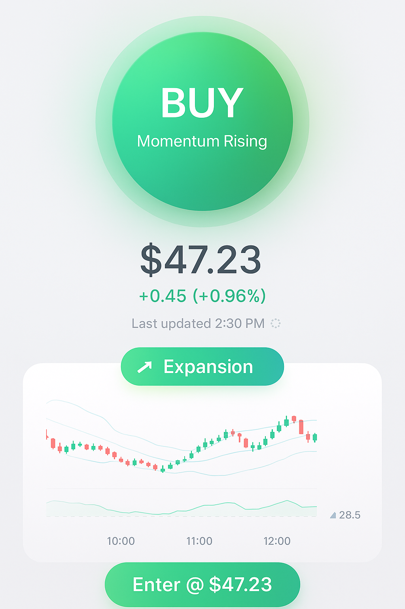

# Economic Trade System - iOS App

Real-time swing trading signals on your iPhone, combining technical analysis with Ray Dalio's economic cycle framework.




---

## ✨ Features

- **Real-time trading signals** (BUY/SELL/HOLD) based on 30-minute bars
- **Technical indicators**: Bollinger Bands, RSI, Keltner Channel, ATR
- **Interactive charts** with Bollinger Bands overlay and RSI subplot
- **Economic cycle tracking** (Expansion, Peak, Contraction, Recovery)
- **Position tracking** with live P/L and stop loss monitoring
- **Multi-symbol support**: GPIX, SPY, QQQ, TSLA, AAPL
- **Auto-refresh** every 30 minutes
- **Secure API key storage** in iOS Keychain
- **Apple-style design** with color-coded signals

---

## 🎯 Trading Strategy

**Entry Signal (BUY):**
- Price drops below lower Bollinger Band
- AND RSI < 30 (oversold)
- Optional: Only during economic expansion

**Exit Signal (SELL):**
- Price crosses above upper Bollinger Band
- OR RSI > 70 (overbought)
- OR stop loss triggered (2% below entry)

## 🚀 Getting Started

### Prerequisites
- Xcode 15+ (for development)
- iOS 17+ device or simulator
- Free API key from [Polygon.io](https://polygon.io/)

### Installation

1. **Clone the repository:**
   ```bash
   git clone https://github.com/westsider/EconomicTradeSystem.git
   cd EconomicTradeSystem
   ```

2. **Open in Xcode:**
   ```bash
   open EconomicTradeSystem.xcodeproj
   ```

3. **Build and run** on your device or simulator (⌘R)

### First-Time Setup

1. **Get a Polygon.io API key:**
   - Sign up at [polygon.io](https://polygon.io/)
   - Free tier includes:
     - 30-minute delayed data (perfect for swing trading)
     - 5 API calls per minute
     - Historical data access

2. **Configure the app:**
   - Launch the app
   - Tap the gear icon (⚙️) in the top-right
   - Enter your Polygon.io API key
   - Tap "Save API Key"

3. **Start trading:**
   - Select a symbol (GPIX, SPY, QQQ, TSLA, AAPL)
   - View real-time signals and charts
   - Pull down to refresh data
   - Monitor open positions and P/L

---

## 🎯 Trading Strategy Details

### Technical Indicators

| Indicator | Parameters | Usage |
|-----------|-----------|-------|
| **Bollinger Bands** | 20-period, 2 std dev | Entry/exit signals |
| **RSI** | 14-period | Oversold (<30) / Overbought (>70) |
| **Keltner Channel** | 20-period, 2x ATR | Squeeze detection |
| **ATR** | 14-period | Volatility measurement |

### Signal Logic

```
BUY:  price < lower_BB AND rsi < 30 [AND economic_expansion]
SELL: price > upper_BB OR rsi > 70 OR stop_loss_hit
HOLD: All other conditions
```

### Risk Management

- **Stop Loss**: 2% below entry price
- **Position Sizing**: 100% of capital per trade (configurable)
- **No pyramiding**: One position at a time
- **Economic filter**: Optional - only trade during expansion

---

## 📂 Project Structure

```
EconomicTradeSystem/
├── EconomicTradeSystem.xcodeproj  # Xcode project file
├── EconomicTradeSystem/
│   ├── Models/                    # Data models
│   │   ├── PriceBar.swift
│   │   ├── TechnicalIndicators.swift
│   │   ├── Signal.swift
│   │   ├── CycleStage.swift
│   │   ├── Position.swift
│   │   └── Trade.swift
│   ├── ViewModels/                # MVVM view models
│   │   └── SignalViewModel.swift
│   ├── Views/                     # SwiftUI views
│   │   ├── SignalView/            # Main signal display
│   │   │   ├── SignalView.swift
│   │   │   ├── SignalCardView.swift
│   │   │   ├── CycleBadgeView.swift
│   │   │   ├── PriceDisplayView.swift
│   │   │   ├── PositionCardView.swift
│   │   │   ├── SymbolPickerView.swift
│   │   │   └── ErrorView.swift
│   │   ├── ChartView/             # Interactive charts
│   │   │   ├── PriceChartView.swift
│   │   │   └── RSIChartView.swift
│   │   └── SettingsView/          # Configuration
│   │       └── SettingsView.swift
│   ├── Services/                  # Business logic
│   │   ├── PolygonService.swift
│   │   ├── IndicatorCalculator.swift
│   │   └── SignalGenerator.swift
│   ├── Utilities/                 # Helpers
│   │   ├── Constants.swift
│   │   ├── Extensions.swift
│   │   └── Formatters.swift
│   └── Persistence/               # Data storage
│       └── KeychainManager.swift
├── README.md                      # This file
├── IMPLEMENTATION_STATUS.md       # Development progress
└── iOS_APP_SPECS.md               # Technical specifications
```

---

## 🛠 Technical Details

### Architecture

- **Pattern**: MVVM (Model-View-ViewModel)
- **UI Framework**: SwiftUI
- **Charts**: Swift Charts framework
- **Networking**: URLSession with async/await
- **Storage**: Keychain for secure API key storage
- **Minimum iOS**: 17.0
- **Language**: Swift 5.9+

### Key Technologies

- **Combine**: Reactive programming for state management
- **async/await**: Modern Swift concurrency
- **Charts framework**: Native iOS charting
- **Codable**: JSON parsing for API responses
- **@Published**: SwiftUI state binding

---

## 📈 Economic Cycle Framework

Based on Ray Dalio's principles, the app will classify the economy into four stages (coming in Phase 3):

| Stage | Indicators | Trading Bias |
|-------|-----------|--------------|
| **🟢 Expansion** | GDP ↑, Employment ↑ | Bullish signals favored |
| **🟠 Peak** | GDP peaks, Inflation high | Caution advised |
| **🔴 Contraction** | GDP ↓, Unemployment ↑ | Bearish signals favored |
| **🔵 Recovery** | GDP bottoms, Rates low | Early bullish signals |

*Note: Economic cycle integration requires FRED API and is planned for a future update.*

---

## 📱 App Screenshots

### Main Signal View
- BUY/SELL/HOLD signal card with technical details
- Current price display with Bollinger Band distances
- Symbol picker for quick switching

### Interactive Charts
- **Price Chart**: 30-minute bars with Bollinger Bands overlay
- **RSI Chart**: Real-time RSI with overbought/oversold zones
- Synchronized time axis for easy correlation

### Position Tracking
- Real-time profit/loss calculation
- Stop loss distance warning
- Entry signal details and timestamp

---

## 🔮 Roadmap

### Phase 2 - Enhanced Features (Completed ✅)
- [x] Interactive price charts with Bollinger Bands
- [x] RSI chart subplot with color coding
- [x] Chart synchronization and legends

### Phase 3 - Economic Integration (Planned)
- [ ] FRED API integration for economic data
- [ ] Real-time economic cycle classification
- [ ] Economic indicator dashboard
- [ ] Cycle-aware signal filtering

### Phase 4 - Notifications (Planned)
- [ ] Push notifications for signal changes
- [ ] Background fetch for auto-updates
- [ ] Price alerts
- [ ] Custom notification preferences

### Phase 5 - Analytics (Planned)
- [ ] Trade history view
- [ ] Performance metrics (win rate, Sharpe ratio)
- [ ] Equity curve visualization
- [ ] Export trade data

### Phase 6 - Advanced (Planned)
- [ ] Multiple watchlists
- [ ] Custom indicator parameters
- [ ] Backtesting interface
- [ ] iOS widgets for home screen

---

## ⚠️ Disclaimer

**This software is for educational and research purposes only.**

- Not financial advice
- Trading involves substantial risk of loss
- Past performance does not guarantee future results
- Always do your own research
- Only trade with capital you can afford to lose
- The authors are not responsible for any trading losses

---

## 🤝 Contributing

Contributions are welcome! Please feel free to submit a Pull Request.

### How to Contribute

1. Fork the repository
2. Create a feature branch (`git checkout -b feature/AmazingFeature`)
3. Commit your changes (`git commit -m 'Add some AmazingFeature'`)
4. Push to the branch (`git push origin feature/AmazingFeature`)
5. Open a Pull Request

### Development Guidelines

- Follow Swift best practices and conventions
- Use MVVM architecture pattern
- Add comments for complex logic
- Test on both iOS simulator and physical device
- Update documentation for new features

---

## 📄 License

This project is licensed under the MIT License - see the [LICENSE](LICENSE) file for details.

---

## 👨‍💻 Author

**Warren Hansen**

- GitHub: [@westsider](https://github.com/westsider)
- Built with assistance from [Claude Code](https://claude.com/claude-code)

---

## 🙏 Acknowledgments

- **Ray Dalio** - Economic cycle framework principles
- **FRED** - Federal Reserve Economic Data
- **Polygon.io** - Financial market data
- **Streamlit** - Web app framework
- **Apple** - SwiftUI and development tools

---

## 📞 Support

For issues, questions, or suggestions:
- Open an issue on GitHub
- Check existing documentation in `iOS_APP_SPECS.md` and `IMPLEMENTATION_STATUS.md`

---

## 🌟 Star This Repo

If you find this project useful, please consider giving it a star ⭐️

---

**Happy Trading! 📈**
